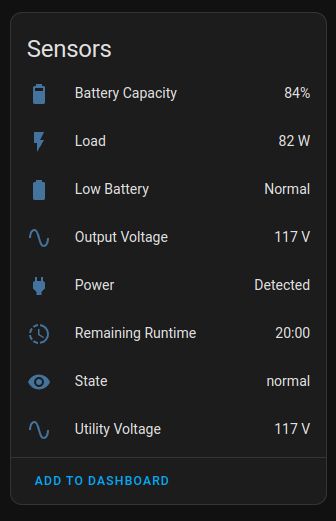

# A pwrstat Home Assistant Integration

An integration to poll a _Cyberpower_ UPS throught the [pwrstat-api](https://github.com/sbruggeman/pwrstat-api) wrapper.

# Thanks

Many thanks to:
* [JetBrains](https://www.jetbrains.com/?from=hass-aarlo) for the excellent  
  **PyCharm IDE** and providing me with an open source licence to speed up the  
  project development.

  [](https://www.jetbrains.com/?from=hass-aarlo)

* @bruggeman for the `pwrstat-api` wrapper.

# Introduction

I wrote this to compliment the _pwrstat-api_ wrapper. I've been accessing the wrapper using the [RESTful API](https://www.home-assistant.io/integrations/rest/) integration and it was working great. But it was lacking full _Integration_ support and monitoring more than one UPS was a pain manage to config.

I decided to add proper _Integration_ support.

The integration needs a working `pwrstat-api` server. The integration does not support any of the cloud feature of _Cyberpower_.

# Requirements

The integration needs a working install of `pwrstat-api` to provide the _UPS_ data in a _JSON_ format. You can install one directly from the official web site or look at the [A Quick pwrstat Docker Image](#a-quick-pwrstat-docker-image) section to see how to set one up from this repository.

# Installing the Integration

## HACS
[](https://github.com/hacs/integration)

Not yet...

## Manually
Copy the `custom_components/pwrstat` directory into your `/config/custom_components` directory.

## From Script
Run the installation script. Run it once to make sure the operations look sane  
and run it a second time with the `go` parameter to do the actual work. If you  
update just rerun the script, it will overwrite all installed files.

```shell  
install /config# check output looks good  
install go /config
```  

Restart your _Home Assistant_ installation.

# Adding and Configuring the Integration

Follow these steps:

- Navigate to `Settings -> Devices & Services`.
- Click on `+ ADD INTEGRATION`.
- Search for `cyberpower` and select it.
- Enter the _UPS_ name, its exact URL including the scheme, and how often you   
  want to poll the device.
- Click `Submit`.

If it works you should see this:



You can enter more than one _UPS_.

# Extras

## Energy Sensor

You can create an energy sensor to convert `W` into `kWh` with something similar to this:

```yaml  
- platform: integration  
  source: sensor.pwrstat_office_ups_load
  name: pwrstat_office_ups_energy
  unit_prefix: k
  round: 2
  method: left  
```  

## A Quick pwrstat Docker Image

This is my snapshot of the `pwrstat-api` docker set up. I modified it to mount the local tools inside the docker so there was no need to include a `deb` file.

You can create a docker instance with these commands:

```bash  
cd extras/pwstatcd
docker build -t ups-status:latest -f dockerfile .
HOME_NAME=your-name-goes-here docker-compose up  
  
# This should work.  
wget -q -O - http://127.0.0.1:5002/pwrstat
{"Battery Capacity": "80 %", "Firmware Number": "BF01902B1D1z", "Last Power Event": "Blackout at 2023/11/25 22:04:46 for 15 sec", "Line Interaction": "None", "Load": "86 Watt(23 %)", "Model Name": "ST Series", "Output Voltage": "116 V", "Power Supply by": "Utility Power", "Rating Power": "375 Watt", "Rating Voltage": "120 V", "Remaining Runtime": "19 min", "State": "Normal", "Test Result": "Passed at 2022/08/24 10:20:31", "Utility Voltage": "116 V"}
```

## Nut
You can also use [Network UPS Tools](https://www.home-assistant.io/integrations/nut/).

And I did for the longest time and it great. I just found it a little too powerful for my needs. I have 2 PCs each with a Cyberpower UPS on them and it ended up being simpler to monitor them in _Home Assistant_ so a lot of the extra functionality was moot. Look at it if you're trying to hook different UPS devices together across a variety of systems.  
